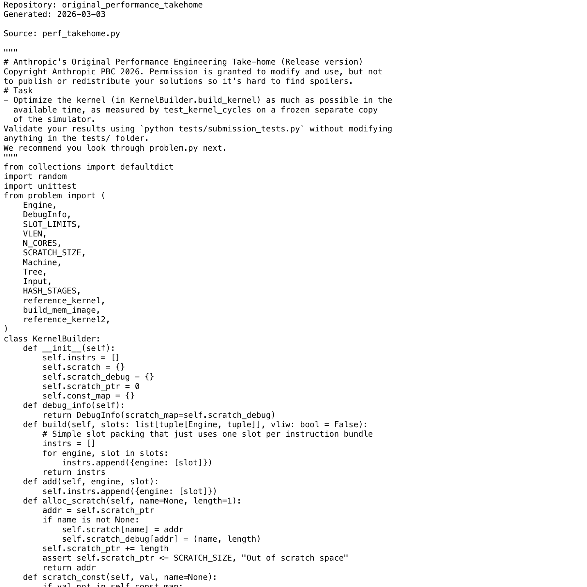

# Project Narrative & Proof

Generated: 2026-03-03

## User Journey
1. Discover the project value in the repository overview and launch instructions.
2. Run or open the build artifact for original_performance_takehome and interact with the primary experience.
3. Observe output/behavior through the documented flow and visual/code evidence below.
4. Reuse or extend the project by following the repository structure and stack notes.

## Design Methodology
- Iterative implementation with working increments preserved in Git history.
- Show-don't-tell documentation style: direct assets and source excerpts instead of abstract claims.
- Traceability from concept to implementation through concrete files and modules.

## Progress
- Latest commit: 74aadd4 (2026-03-03) - docs: restore Readme.md with fork badge line
- Total commits: 3
- Current status: repository has baseline narrative + proof documentation and CI doc validation.

## Tech Stack
- Detected stack: GitHub Actions, Python, HTML/CSS

## Main Key Concepts
- Key module area: `tests`

## What I'm Bringing to the Table
- End-to-end ownership: from concept framing to implementation and quality gates.
- Engineering rigor: repeatable workflows, versioned progress, and implementation-first evidence.
- Product clarity: user-centered framing with explicit journey and value articulation.

## Show Don't Tell: Screenshots


## Show Don't Tell: Code Excerpt
Source: `perf_takehome.py`

```py
"""
# Anthropic's Original Performance Engineering Take-home (Release version)
Copyright Anthropic PBC 2026. Permission is granted to modify and use, but not
to publish or redistribute your solutions so it's hard to find spoilers.
# Task
- Optimize the kernel (in KernelBuilder.build_kernel) as much as possible in the
  available time, as measured by test_kernel_cycles on a frozen separate copy
  of the simulator.
Validate your results using `python tests/submission_tests.py` without modifying
anything in the tests/ folder.
We recommend you look through problem.py next.
"""
from collections import defaultdict
import random
import unittest
from problem import (
    Engine,
    DebugInfo,
    SLOT_LIMITS,
    VLEN,
    N_CORES,
    SCRATCH_SIZE,
    Machine,
    Tree,
    Input,
    HASH_STAGES,
    reference_kernel,
    build_mem_image,
    reference_kernel2,
)
class KernelBuilder:
    def __init__(self):
        self.instrs = []
        self.scratch = {}
        self.scratch_debug = {}
```
